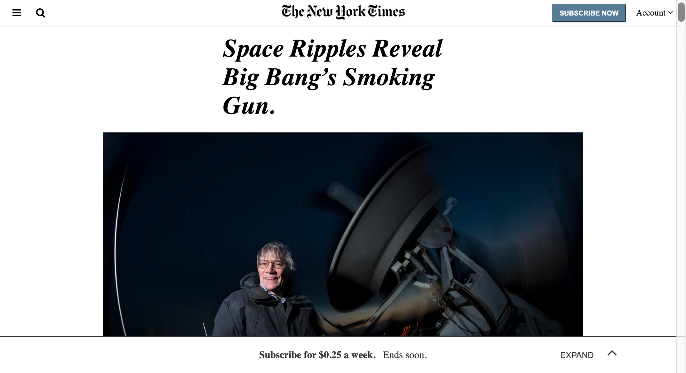

  

# New York Times Clone

> HTML/CSS3 3rd Project on Positioning and Floating Elements. The project focusses on the use of different kinds of positioning, floating and use of Flex and Grids displays.

## Built With

- HTML
- CSS3

## Live Demo

[Live Demo Link](https://raw.githack.com/IjayAbby/new-york-times-clone/development/index.html)

## Authors

- 👤 [@oracleot](https://github.com/oracleot)

- 👤 [@IjayAbby](https://github.com/IjayAbby)

## 🤝 Contributing

Contributions, issues and feature requests are welcome!

Feel free to check the [issues page](issues/).

## 📝 License

This project is [MIT](lic.url) licensed.
